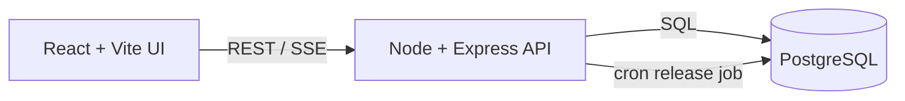

# Content Review Queue

Full-stack prototype for locale scoped content review tickets. Reviewers log in with a reviewer ID and locale, see only available tickets for that locale, reserve one ticket for 20 minutes, and confirm processing before the hold expires. Expired holds are automatically released back into the queue.

## Run With Docker

```bash
docker-compose up --build
```

Services:

- Frontend: http://localhost:5173
- Backend API: http://localhost:4000/api
- Postgres: localhost:5433

Seeded reviewers:

| Reviewer ID | Locale |
| --- | --- |
| 1 | West Coast |
| 2 | East Coast |
| 3 | Midwest |
| 4 | South |
| 5 | West Coast |
| 6 | East Coast |

Set `DATABASE_URL` for the backend if you are not using the Docker Postgres service.

## Architecture



## Data Model

Tables:

- `reviewers`: seeded reviewer identities and locale assignment.
- `tickets`: the current ticket state, locale, active flag, and current reservation pointer.
- `reservations`: a reservation history table with `ACTIVE`, `CONFIRMED`, and `EXPIRED` states.

Note:

- Ticket status is limited to `AVAILABLE`, `RESERVED`, or `CONFIRMED`.
- Reservation status is limited to `ACTIVE`, `CONFIRMED`, or `EXPIRED`.

## Ticket Ingestion

Tickets are generated by the startup seed script in `backend/src/db/seed.js`. It inserts six reviewers and 48 locale-tagged tickets only when the database has no tickets yet.

## API Reference

All protected endpoints accept either the `crq_session` cookie set by login or `Authorization: Bearer <token>`.

Login:

```bash
curl -i -c cookies.txt \
  -H "Content-Type: application/json" \
  -d '{"reviewerId":1,"locale":"West Coast"}' \
  http://localhost:4000/api/login
```

List available tickets for the authenticated reviewer locale:

```bash
curl -b cookies.txt http://localhost:4000/api/tickets/available
```

Reserve a ticket:

```bash
curl -b cookies.txt -X POST http://localhost:4000/api/tickets/1/reserve
```

Get the current active reservation:

```bash
curl -b cookies.txt http://localhost:4000/api/tickets/current
```

Confirm a reservation:

```bash
curl -b cookies.txt -X POST http://localhost:4000/api/tickets/1/confirm
```

Queue metrics:

```bash
curl -b cookies.txt http://localhost:4000/api/metrics
```

Dashboard metrics for the authenticated reviewer locale:

```bash
curl -b cookies.txt http://localhost:4000/api/metrics/locale
```

Server-Sent Events:

```bash
curl -N -b cookies.txt http://localhost:4000/api/events
```

Health check:

```bash
curl http://localhost:4000/api/health
```

## Reservation Logic

Reservation is an atomic database operation:

1. Expired reservations are released opportunistically.
2. The API checks whether the reviewer already has an active reservation.
3. The target ticket is updated from `AVAILABLE` to `RESERVED` only if its ID, locale, active flag, and status match.
4. A reservation row is inserted in the same transaction.

If two reviewers try to reserve the same ticket, only one update can succeed. If one reviewer tries to reserve two tickets at once, the active-reservation constraint prevents hoarding.

Confirmation is also transactional. It succeeds only when the reservation belongs to the authenticated reviewer, belongs to the same locale, is still active, and has not expired.

Expired reservations are released in two ways:

- A cron job runs once every 2 seconds.
- Queue read/reserve/confirm paths also release stale holds before continuing, so a delayed cron tick does not block the queue.

## Real-Time Updates

The backend exposes `/api/events` using Server-Sent Events. Events are filtered by reviewer locale before delivery:

- `ticket_reserved`
- `ticket_confirmed`
- `ticket_released`

The frontend listens for these events and refreshes queue state.

## Design Decisions

- PostgreSQL is the source of truth because ticket reservation is a concurrency-sensitive operation. Using atomic transactions ensures that selecting and reserving a ticket occurs as a single indivisible operation, preventing multiple reviewers from claiming the same ticket simultaneously.
- Sessions are intentionally minimal: login verifies seeded reviewer ID plus locale and returns an expiring random session token.
- The `/metrics` and `/events` endpoints are protected, avoiding unauthenticated queue visibility.

## Walkthrough Video

part 1: https://www.loom.com/share/09e4afa8561b4ad9be1e6dbcb0b5c7cb  
part 2: https://www.loom.com/share/c2ab0087497144efaaeea97890910c18  

## AI / LLM Usage
AI assistance was used for the initial dashboard UI structure and styling in [frontend/src/App.jsx](frontend/src/App.jsx) and [frontend/src/styles.css](frontend/src/styles.css). I reviewed, adapted, and tested the final implementation. It was also used to generate the initial [README.md](README.md) file, which I then reviewed and edited for accuracy and clarity.

